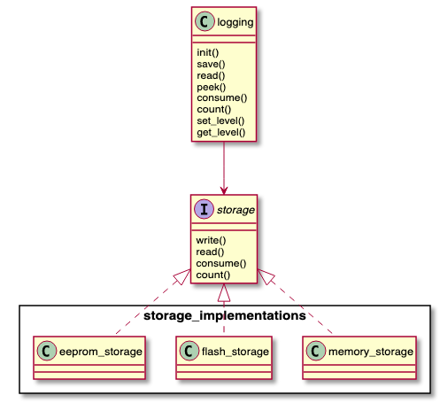
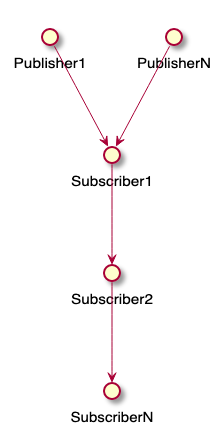
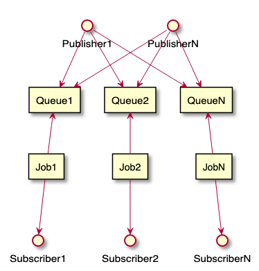
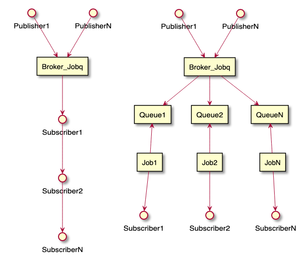

# libmcu

[](https://sonarcloud.io/dashboard?id=onkwon_libmcu)
[](https://sonarcloud.io/dashboard?id=onkwon_libmcu)
[](https://codecov.io/gh/onkwon/libmcu)

A toolkit for firmware development.

Some of components have dependency on [libmcu/logging](#logging). You can get
rid of the dependency by defining an empty `logging_save()` in case you're not
using it. Please refer to [tests/stubs/logging.c](tests/stubs/logging.c).

## Data Structure
### list
Singly Linked List
### llist
Doubly Linked List
### queue
### bitmap
### ringbuf

## Logging


On ARM Cortex-M cores, it uses 128 bytes stack at most with no dynamic
allocation at all. And a log size is 16 bytes excluding user messages.

An example for storage implementation can be found
[examples/memory_storage.c](examples/memory_storage.c) and a simple server-side
script [scripts/translate_log.py](scripts/translate_log.py).

Writing a log in a structured way would help you see and trace easier on the
server side, something like:

```c
info("#battery %d%%", battery");
info("rssi %d", rssi); // #wifi unit:dBm
error("#i2c timeout");
```

## jobqueue
A small job like calling an event handler can be done using jobqueue rather than
creating a new thread or task which is too much for such a job since it takes
quite a lot of resources.

## PubSub
### Simple usecase
The callback function should be as simple and fast as possible since it runs in
the context of a caller(publisher) in sequence, one by one.



```c
static void hello_callback(void *context, const void *msg, size_t msglen) {
	printf("%.*s\n", msglen, msg);
}
pubsub_subscribe("mytopic", hello_callback, NULL);
pubsub_publish("mytopic", "Hello, World!", strlen("Hello, World!"));
```

### Usecase with queue
Each subscriber runs concurrently as a job while a publisher has the
responsiblility to publish a message for jobs to each queues.



```c
static void event_callback(void *context, const void *msg, size_t msglen)
{
	queue_t event_queue = (queue_t)context;
	...
	queue_send(event_queue, new_queue_data);
}

static void job1(uint32_t timeout_ms)
{
	queue_receive(event_queue1, buf, timeout_ms);
}
static void job2(uint32_t timeout_ms)
{
	queue_receive(event_queue2, buf, timeout_ms);
}
static void jobN(uint32_t timeout_ms)
{
	queue_receive(event_queueN, buf, timeout_ms);
}

pubsub_subscribe("mytopic", event_callback, event_queue1);
pubsub_subscribe("mytopic", event_callback, event_queue2);
pubsub_subscribe("mytopic", event_callback, event_queueN);

pubsub_publish("mytopic", data, data_size);
```

### Usecase with Jobqueue as broker
Jobqueue is used as a broker. Both of publishing and subscribing can be done
concurrently in another context.



## Apptimer
It implements hierarchical timing wheels. Insertion and deletion is worst case
O(1). Per-tick bookkeeping is also O(1), but is a little tricky because every
time wheel unit time passing, all the slots of lower wheels get updated, which
is not cache friendly.

Adjusting the number of wheels and slots, you might meet the requirements. e.g.
it would be simple timing wheels when `NR_WHEELS=1` with timeout limitation.
There is space-time tradeoff. The more slots the faster while the more slots the
more memory.

A timer takes 25 bytes on 32-bit system. 4 bytes more can be saved replacing
doubly linked list with singly linked list. There would be no performance
penalty to use singly linked list instead as long as slots are big enough for
timers to be well distributed.

## Metrics

## shell
A tiny CLI shell.

## kvstore
Key-Value Store
## utils
### sleep
### mode
### retry
```c
retry_t retry = { .sleep = sleep_ms, };
do {
	if (do_something() == true) {
		break;
	}
} while (retry_backoff(&retry) != RETRY_EXHAUSTED);
```
## compiler
## semaphore
