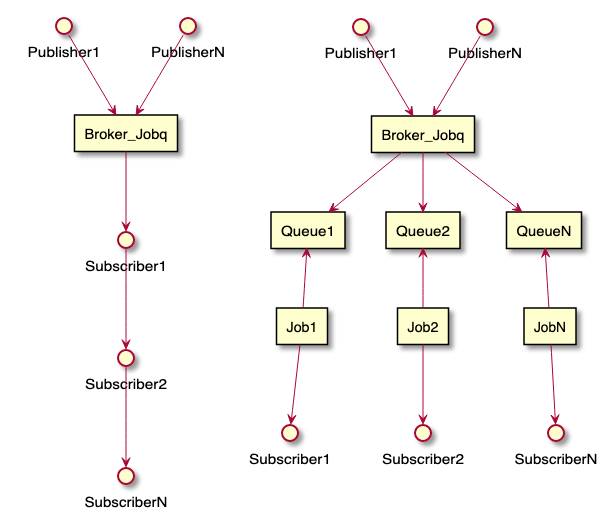

# pubsub

## Overview
### Simple usecase
The callback function should be as simple and fast as possible since it runs in
the context of a caller(publisher) in sequence, one by one.


```c
static void hello_callback(void *context, const void *msg, size_t msglen) {
	printf("%.*s\n", msglen, msg);
}
pubsub_subscribe("mytopic", hello_callback, NULL);
pubsub_publish("mytopic", "Hello, World!", strlen("Hello, World!"));
```

### Usecase with queue
Each subscriber runs concurrently as a job while a publisher has the
responsiblility to publish a message for jobs to each queues.


```c
static void event_callback(void *context, const void *msg, size_t msglen)
{
	queue_t event_queue = (queue_t)context;
	...
	queue_send(event_queue, new_queue_data);
}

static void job1(uint32_t timeout_ms)
{
	queue_receive(event_queue1, buf, timeout_ms);
}
static void job2(uint32_t timeout_ms)
{
	queue_receive(event_queue2, buf, timeout_ms);
}
static void jobN(uint32_t timeout_ms)
{
	queue_receive(event_queueN, buf, timeout_ms);
}

pubsub_subscribe("mytopic", event_callback, event_queue1);
pubsub_subscribe("mytopic", event_callback, event_queue2);
pubsub_subscribe("mytopic", event_callback, event_queueN);

pubsub_publish("mytopic", data, data_size);
```

### Usecase with Jobqueue as broker
Jobqueue is used as a broker. Both of publishing and subscribing can be done
concurrently in another context.



## Integration Guide
