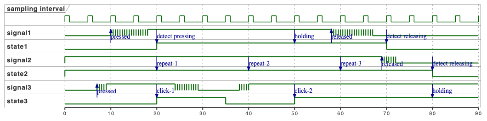

# button

## Overview
The debouncer that I implemented here learned from [Elliot Williams's Debounce Your Noisy Buttons article](https://hackaday.com/2015/12/10/embed-with-elliot-debounce-your-noisy-buttons-part-ii/).

### Timing Diagram


Note that the sampling period is 5 milliseconds, the debounce duration is 10 milliseconds, the repeat delay is 30 milliseconds, and the repeat rate is 20 milliseconds in the diagram for convenience.

## Integration Guide
### Default Parameters
* `BUTTON_MAX`
  - The maximum number of buttons. The default is 8.
* `BUTTON_SAMPLING_PERIOD_MS`
  - The sampling period. The default is 10 milliseconds.
* `BUTTON_DEBOUNCE_DURATION_MS`
  - The debounce duration. The default is 20 milliseconds.
* `BUTTON_REPEAT_DELAY_MS`
  - The repeat handler is called after the defined delay while button holding. The default is 300 milliseconds.
  - Holding functionality will be disabled if the value is 0.
* `BUTTON_REPEAT_RATE_MS`
  - The repeat handler is called every BUTTON_REPEAT_RATE_MS while button holding. The default is 200 milliseconds.
  - Repeat functionality will be disabled if the value is 0.
* `BUTTON_CLICK_WINDOW_MS`
  - The click handler is called with the number of clicks when another click comes in the time window. The default is 500 milliseconds.
  - Click functionality will be disabled if the value is 0.
* `BUTTON_SAMPLING_TIMEOUT_MS`
  - The timeout for the sampling period. The default is 1000 milliseconds.
  - If set to 0, the default value will be used.
  - If step is not called in the defined timeout, the changed until the next step will be ignored. But the last state will be kept.
 
### Initialize GPIO to be used for button
This is platform specific, something like in case of NRF5:

```c
button_level_t get_button_state(void *ctx) {
	return nrf_gpio_pin_read(YOUR_BUTTON)? BUTTON_LEVEL_HIGH : BUTTON_LEVEL_LOW;
}
```

> Interrupt can be a trigger to scan button states rather than polling which wastes cpu resources.

### Create a button

```c
static void on_button_event(struct button *btn, const button_state_t event,
                            const uint16_t clicks, const uint16_t repeats, void *ctx) {
    switch (event) {
    case BUTTON_STATE_PRESSED:
        printf("pressed: %u click(s)\n", clicks);
        break;
    case BUTTON_STATE_RELEASED:
        printf("released: %u click(s), %u repeat(s)\n", clicks, repeats);
        break;
    case BUTTON_STATE_HOLDING:
        printf("holding: %u repeat(s)\n", repeats);
        break;
    }
}

int main(void) {
    struct button *btn = button_new(get_button_state, 0, on_button_event, 0);
    button_enable(btn);

    while (1) {
#if DO_DELTA_TIME
        const uint32_t now = millis();
        button_step_delta(btn, now - t0);
        t0 = now;
#else
        const uint32_t now = millis();
        button_step(btn, now);
#endif
        ...
    }

    button_disable(btn);
    button_delete(btn);
}
```

then registered handler will be called when button activity detected.

## Notes
- Every changes of button state will be notified to the registered handler.
  - For example, if the button is pressed and held, the handler will be called with BUTTON_STATE_PRESSED and BUTTON_STATE_HOLDING.
  - If the button is pressed, held and one more click is detected, the handler will be called 5 times in total:
    - `BUTTON_STATE_PRESSED` with click count 1.
    - `BUTTON_STATE_HOLDING` with click count 1 and repeat count 1.
    - `BUTTON_STATE_RELEASED` with click count 1 and repeat count 1.
    - `BUTTON_STATE_PRESSED` with click count 2.
    - `BUTTON_STATE_RELEASE` with click count 2.
